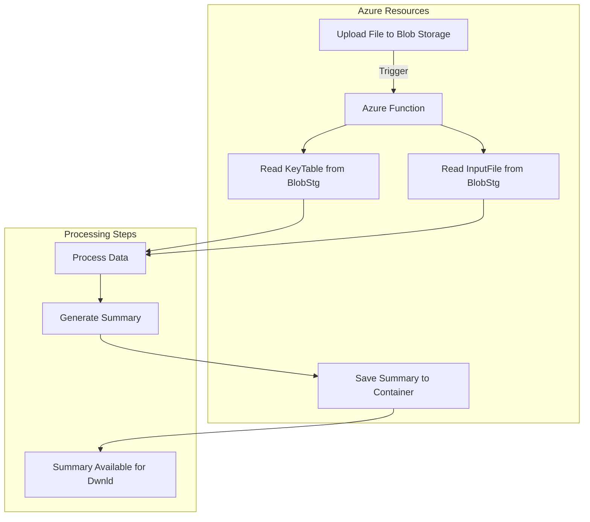

# E2E (End to End) Workflow: Overview 

Costa Rica

[Cloud2BR OSS - Learning Hub](https://github.com/Cloud2BR-MSFTLearningHub)

Last updated: 2025-02-21

------------------------------------------

<b>List of references</b> (Click to expand)

- [Quickstart: Azure AI Vision v3.2 GA Read](https://learn.microsoft.com/en-us/azure/ai-services/computer-vision/quickstarts-sdk/client-library?tabs=windows%2Cvisual-studio&pivots=programming-language-python)
- [Quickstart: Azure Blob Storage client library for Python](https://learn.microsoft.com/en-us/azure/storage/blobs/storage-quickstart-blobs-python?tabs=managed-identity%2Croles-azure-portal%2Csign-in-azure-cli&pivots=blob-storage-quickstart-scratch)
- [Create a function in Azure that's triggered by Blob storage](https://learn.microsoft.com/en-us/azure/azure-functions/functions-create-storage-blob-triggered-function)
- [Quickstart: Azure Key Vault secret client library for Python](https://learn.microsoft.com/en-us/azure/key-vault/secrets/quick-create-python?tabs=azure-cli)
- [Azure Application Insights SDK for Python](https://learn.microsoft.com/en-us/python/api/overview/azure/application-insights?view=azure-python)
- [Create a Log Analytics workspace](https://learn.microsoft.com/en-us/azure/azure-monitor/logs/quick-create-workspace?tabs=azure-portal)
- [Quickstart: Use the Azure portal to create a virtual network](https://learn.microsoft.com/en-us/azure/virtual-network/quick-create-portal)

<b>List of Contents</b> (Click to expand)

- [Workflow](#workflow)
- [Architecture: Components and Interactions](#architecture-components-and-interactions)

## Workflow

1. **Upload File to Blob Storage**: Users upload files to the input container in Azure Blob Storage.
2. **Azure Function**: The Azure Function is triggered by the file upload.
3. **Read Key Table from Blob Storage**: The function reads the key table from the input container.
4. **Read Input File from Blob Storage**: The function reads the uploaded input file from the input container.
5. **Process Data**: The function processes the data by searching for key values and extracting relevant information.
6. **Generate Summary**: The function generates a summary based on the processed data.
7. **Save Summary to Output Container**: The function saves the summary to the output container in Azure Blob Storage.
8. **Summary Available for Download**: The summary is available for download from the output container.

## Architecture: Components and Interactions 

  

<!-- START BADGE -->

  
  
Refresh Date: 2026-04-07

<!-- END BADGE -->
