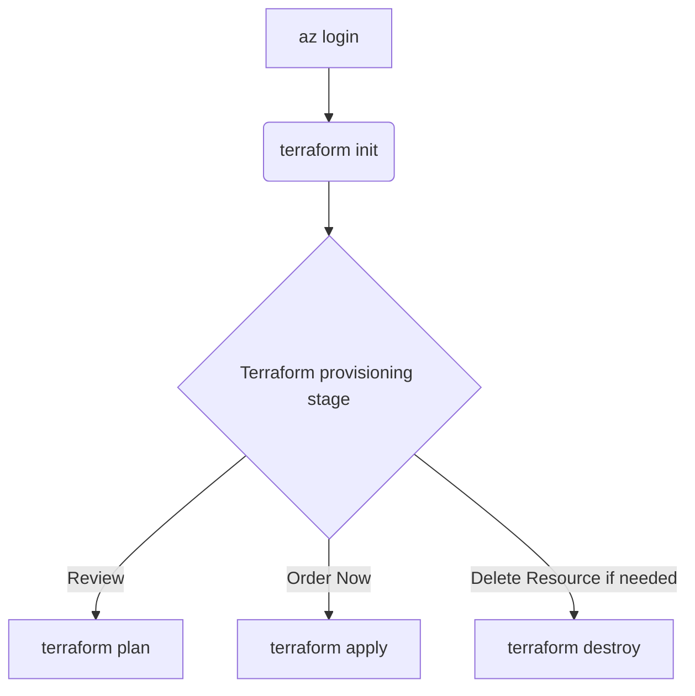

# Terraform deployment for Azure resources required for this use case

Costa Rica

[](https://github.com/)
[Cloud2BR OSS - Learning Hub](https://github.com/Cloud2BR-MSFTLearningHub)

Last updated: 2026-04-07

------------------------------------------

> Terraform templates to deploy an Azure-based automated file processing and summary generation tool. The solution includes:

<div align="center">
  
</div>

<details>
<summary><b>Table of Content </b> (Click to expand)</summary>

- [Overview](#overview)
- [Resources](#resources)
- [How to execute it](#how-to-execute-it)

</details>


## Overview 

```text
.
├── README.md
├── src
├────── main.tf
├────── variables.tf
├────── provider.tf
├────── terraform.tfvars
├────── remote-storage.tf 
├────── outputs.tf
```

- **main.tf** `(Main Terraform configuration file)`: This file contains the core infrastructure code. It defines the resources you want to create, such as Azure Blob Storage, Azure Functions, and other necessary services. It's the primary file where you describe your infrastructure in a declarative manner.
- **variables.tf** `(Variable definitions)`: This file is used to define variables that can be used throughout your Terraform configuration. By using variables, you can make your configuration more flexible and reusable. For example, you can define variables for resource names, sizes, and other parameters that might change between environments.
- **provider.tf** `(Provider configurations)`: Providers are plugins that Terraform uses to interact with cloud providers, SaaS providers, and other APIs. This file specifies the Azure provider and any necessary configuration for it, such as authentication details.
- **terraform.tfvars** `(Variable values)`: This file contains the actual values for the variables defined in `variables.tf`. By separating variable definitions and values, you can easily switch between different sets of values for different environments (e.g., development, staging, production) without changing the main configuration files.
- **remote-storage.tf** `(Remote state storage configuration)`: Terraform uses a state file to keep track of the resources it manages. This file configures remote state storage, which allows you to store the state file in a remote location (e.g., Azure Blob Storage). Remote state storage is crucial for collaboration and ensuring that the state file is not lost or corrupted.
- **outputs.tf** `(Output values)`: This file defines the output values that Terraform should return after applying the configuration. Outputs are useful for displaying information about the resources created, such as resource IDs, connection strings, and other important details. They can also be used as inputs for other Terraform configurations or scripts.

## Resources 

| Resource                | Description                                                                                   |
| :---------------------- | :-------------------------------------------------------------------------------------------- |
| Azure Resource Group    | A logical container that organizes and manages all the related Azure resources.               |
| Azure Blob Storage      | Stores input files (xlsx, csv, docs, pdfs) and output summary files.                          |
| Azure Functions         | Executes serverless compute tasks to process the uploaded files and generate summaries.       |
| Azure AI Services       | Provides text analytics and OCR capabilities to handle text data from docs and pdfs.          |
| Azure Storage Account   | Manages Blob Storage and other storage services.                                               |
| Azure Key Vault         | Stores and manages sensitive information such as connection strings and API keys.             |
| Application Insights    | Monitors the performance and usage of the file processing tool.                                |
| Log Analytics Workspace | Collects and analyzes log data from various sources.                                           |

## How to execute it 



> [!IMPORTANT]
> Please modify `terraform.tfvars` with your information. Then run the following flow:

1. **Login to Azure**: This command logs you into your Azure account. It opens a browser window where you can enter your Azure credentials. Once logged in, you can manage your Azure resources from the command line.

    ```sh
    cd ./terraform/src/
    ```

    ```sh
    az login
    ```

    <div align="center">
      
    </div>
    

2. **Initialize Terraform**: Initializes the working directory containing the Terraform configuration files. It downloads the necessary provider plugins and sets up the backend for storing the state.

    ```sh
    terraform init
    ```

    <div align="center">
      
    </div>


3. **Terraform Provisioning Stage**: 

   - **Review**: Creates an execution plan, showing what actions Terraform will take to achieve the desired state defined in your configuration files. It uses the variable values specified in `terraform.tfvars`.

        ```sh
        terraform plan -var-file terraform.tfvars
        ```

        <div align="center">
          
        </div>

   - **Order Now**: Applies the changes required to reach the desired state of the configuration. It prompts for confirmation before making any changes. It also uses the variable values specified in `terraform.tfvars`.

        ```sh
        terraform apply -var-file terraform.tfvars
        ```
  
       <div align="center">
          
        </div>

       <div align="center">
          
        </div>

   - **Remove**: Destroys the infrastructure managed by Terraform. It prompts for confirmation before deleting any resources. It also uses the variable values specified in `terraform.tfvars`.
    
        ```sh
        terraform destroy -var-file terraform.tfvars
        ```

<!-- START BADGE -->
<div align="center">
  
  <p>Refresh Date: 2026-04-07</p>
</div>
<!-- END BADGE -->

